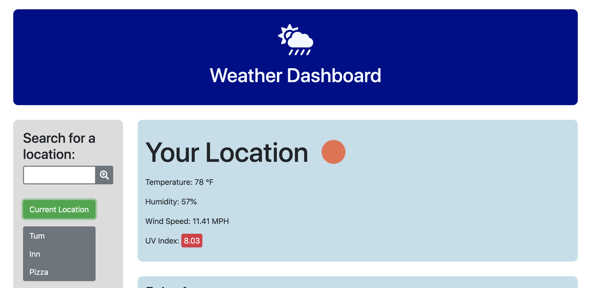
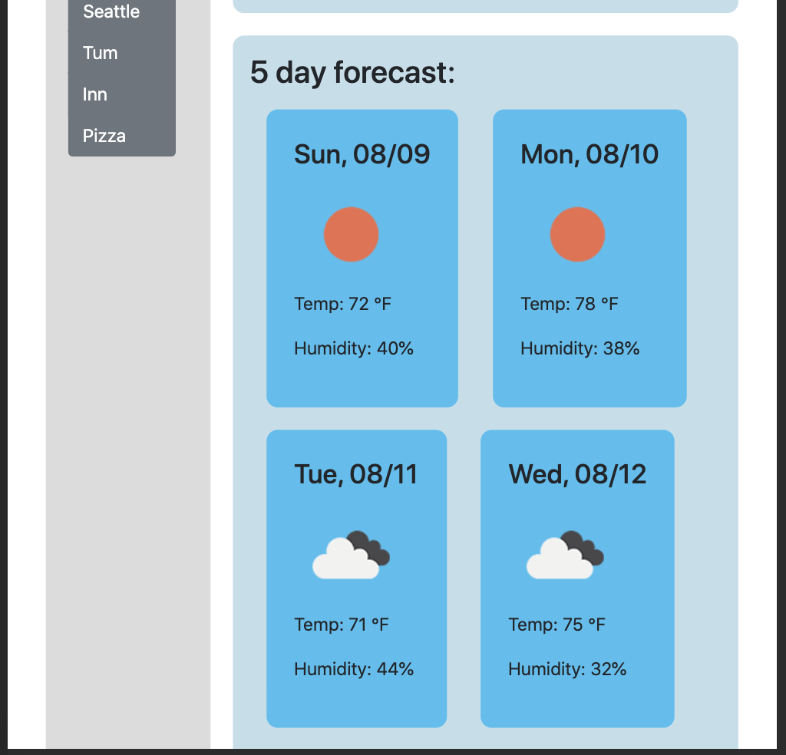

# Weather Dashboard

A weather dashboard to give current and forecasted weather for your location. The app defaults to Seattle on load but the user may search for their location or click on any past searches.

### Features
* Displays current weather (temp, humidity, wind speed, UV index) and a 5 day forecast
* Weather data from openweather
* Stores recent searches in local storage so the user can access them in a list during future visits

#### Uses:
* Open Weather API
* Geolocation API
* Local storage
* jQuery
* Bootstrap 4.3
* CSS Grid for layout (flexbox for forecast tiles)
* moment.js

## Deployed via Github Pages
[Find it here](https://zapponejosh.github.io/hw-6-weather-app/)

Copyright 2020 Joshua Zappone

Permission is hereby granted, free of charge, to any person obtaining a copy of this software and associated documentation files (the "Software"), to deal in the Software without restriction, including without limitation the rights to use, copy, modify, merge, publish, distribute, sublicense, and/or sell copies of the Software, and to permit persons to whom the Software is furnished to do so, subject to the following conditions:

The above copyright notice and this permission notice shall be included in all copies or substantial portions of the Software.

THE SOFTWARE IS PROVIDED "AS IS", WITHOUT WARRANTY OF ANY KIND, EXPRESS OR IMPLIED, INCLUDING BUT NOT LIMITED TO THE WARRANTIES OF MERCHANTABILITY, FITNESS FOR A PARTICULAR PURPOSE AND NONINFRINGEMENT. IN NO EVENT SHALL THE AUTHORS OR COPYRIGHT HOLDERS BE LIABLE FOR ANY CLAIM, DAMAGES OR OTHER LIABILITY, WHETHER IN AN ACTION OF CONTRACT, TORT OR OTHERWISE, ARISING FROM, OUT OF OR IN CONNECTION WITH THE SOFTWARE OR THE USE OR OTHER DEALINGS IN THE SOFTWARE.